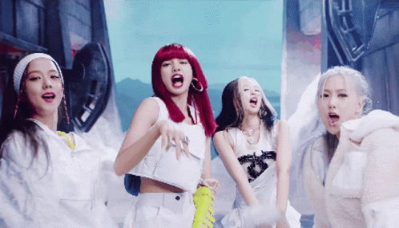

## Twitter Sentiment Analysis with Neural Networks: K-pop Industry

Final Report [here](https://github.com/francisfjin/twitter-NLP/blob/main/finalreport.pdf), or even better - check out the [webpage!](https://francisfjin.github.io/twitter-NLP/)

This project utilizes machine learning and Natural Language Processing to conduct [Sentiment Analysis](https://www.google.com/search?q=sentiment+analysis&rlz=1C5CHFA_enUS911US911&oq=sentiment+analysis&aqs=chrome..69i57j69i59l3j69i60l3.1648j0j7&sourceid=chrome&ie=UTF-8) on Twitter data for Media & Entertainment in Asia, specifically the K-Pop industry which has become one of the [most popular musical genres in the world.](https://www.rollingstone.com/music/music-features/bts-kpop-albums-bands-global-takeover-707139/) 

This insight can be used to measure current social sentiment, climate, popularity, and inform numerous business practices such as marketing, promotion, and strategy, album releases, etc. 

#### Models 
- _Keras Neural Network_
- _Google AutoML_

The main script [Twitter_public.ipynb](https://github.com/francisfjin/twitter-NLP/blob/main/Twitter_public.ipynb) uses Tweepy API to search for a user-defined set of tweets given keyword of your choosing. Then it creates a training set on labeled data using an awesome corpus file from Niek Sanders [here](https://github.com/karanluthra/twitter-sentiment-training/blob/master/corpus.csv), with ID keys to 5000 sentiment-labeled tweets, which we then grab through the Twitter API as to comply with their Developer API usage rules. Pre-processing is done using Natural Language Processing libraries: spacy, nltk, re.

Training data is then fed into two models: Keras Neural Network and Google AutoML.

Keras Neural Network: a TFIDF transformation is performed on the pre-processed training set along with Glove embedding, then fed into a Sequential Keras model with Dropout, to yield (~88%/81%) accuracy scores on training/validation sets!

AutoML: Writes training set to CSV for Google AutoML required format. Then in Google Cloud Platform an [AutoML model](https://cloud.google.com/automl) for NLP Sentiment Analysis can be trained on the set. For predictions the search set of tweets is exported to individual txt files as per AutoML's [BatchPredict input file requirements](https://cloud.google.com/natural-language/automl/docs/predict?authuser=3), it also writes a CSV of the keys in the required format. 

[AutoMLpythonclient_public.ipynb](https://github.com/francisfjin/twitter-NLP/blob/main/AutoMLpythonclient_public.ipynb) is the Python client to run the deployed model. Requires input GCP credentials, and test files must saved to GCP storage bucket before running predictions.   

## Notes

The notebooks are best run in Google Colab for seamless execution. You'll have to input your own file paths for your GCP locations and [mount your Drive](https://colab.research.google.com/notebooks/io.ipynb). 

For Twitter API, you will need to input your own API keys from your [developer account](https://developer.twitter.com/en/apply-for-access). This is necessary for building the Training Set.

Python packages required: 
- Tweepy
- Twitter 
- Spacy 
- nltk
- re
- Keras
- Google Cloud AutoML

[#blackpinkinyourarea](https://www.youtube.com/watch?v=ioNng23DkIM)

